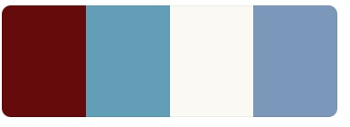
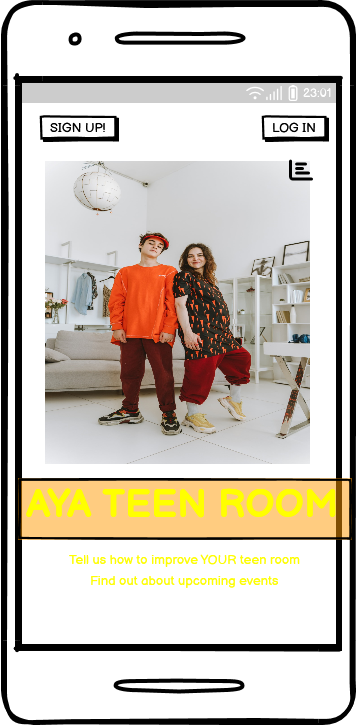
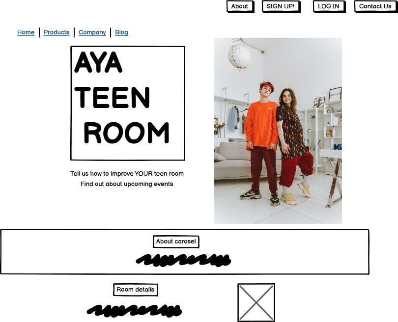
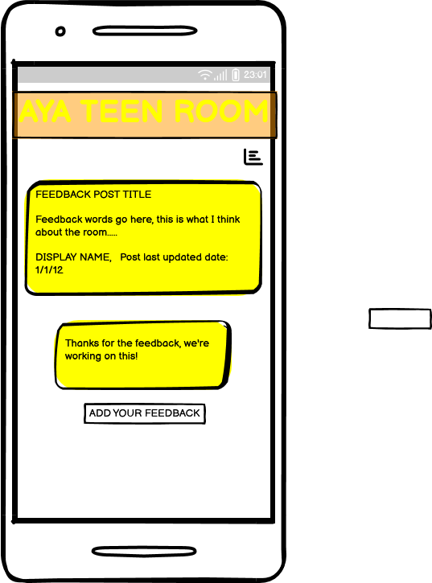
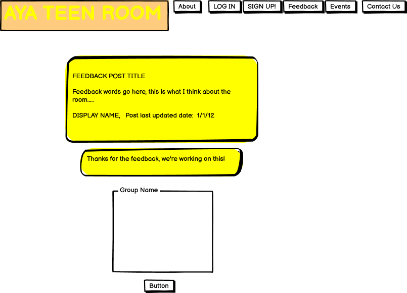
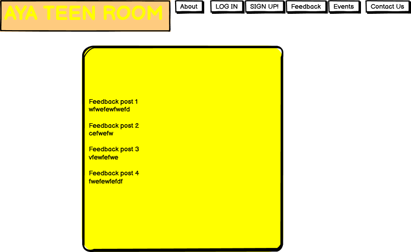
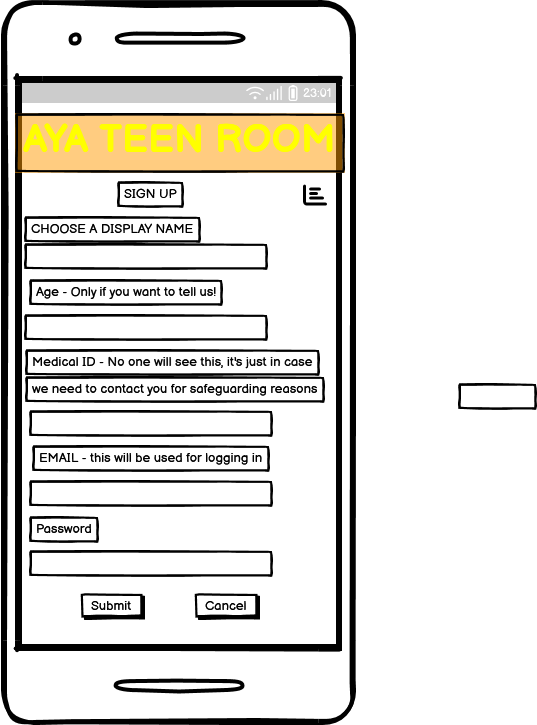
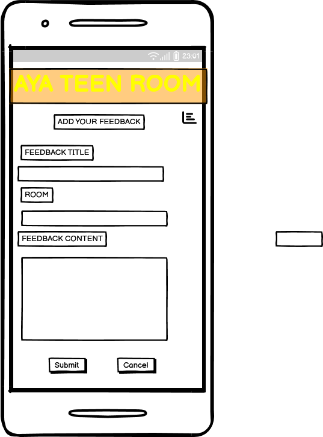
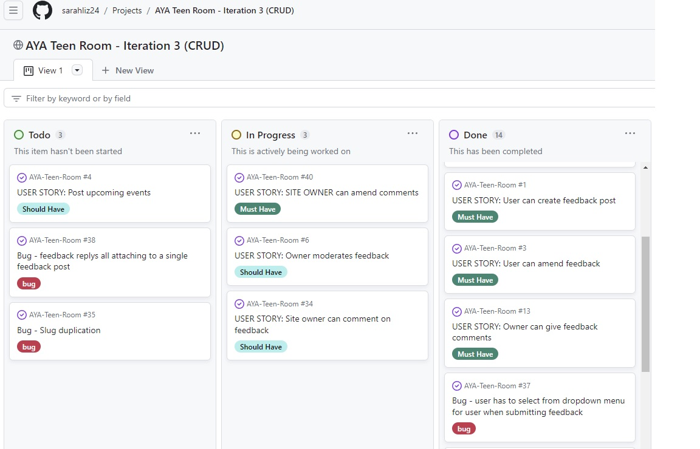

#  AYA Teen Room

## Site Link: <a href="" target="_blank">#</a>

1. [Introduction](#introduction)
2. [User Experience](#user-experience)
3. [Design](#design)
4. [Project Management](#projectd-management)
5. [Features](#features)
6. [Future Features](#future-features)
7. [Testing](#testing)
    1. [Validator Testing](#validator-testing)
    2. [Manual Testing](#manual-testing)
8. [Bugs](#bugs)
    1. [Known Bugs](#known-bugs)
    2. [Solved Bugs](#solved-bugs)
9. [Deployment](#deployment)
    1. [Github](#github)
    2. [Heroku](#heroku)
10. [Credits](#credits)
    1. [Code Used](#code-used)
    2. [Content](#content)
    3. [Technologies Used](#technologies-used)
11. [Acknowledgements](#acknowledgements)

## Site Link: (https://#)

# INTRODUCTION

AYA Teen Room is a website aimed at gathering feedback from AYA Teen Room Users in order to facilitate room owners to improve the rooms according to users needs.

AYA Teen Rooms are rooms based on cancer wards in the 4 main centres that treat cancer for adolescents and young adults (AYAs) in Ireland. The teen rooms are lounge spaces solely for the use of AYAs who are staying in the ward for cancer treatment. These rooms give the AYAs a safe and relaxing space to spend time away from the ward rooms, which are often busy, noisy, and populated with either children or older adults (depending on the ward/hospital).

The philosophy of the AYA treatment team is to always put the users at the centre of every decision made, and making sure the teen rooms are serving the needs of the user by ensuring teen feedback is received, and that the AYAs can see feedback being acted on,  demonstrates this to the AYAs clearly.  This helps to build trust with the treating team, and improves the treatment experience for the AYAs.

# User Experience

## Target Audience

The target audience is AYA patients, who are aged between 13 - 24 years old, who are having cancer treatment at one of the 4 hospitals with an AYA teen room.

## Site Aims

* To provide a way to gather teen room user feedback on the teen rooms
* To allow users to give feedback in a private way
* To allow AYA staff to let users know how their feedback is being implemented

## User Stories

### As a user:

1. As a teen room user I can be a registered site user so that I know only my teen room peers are on the site

2. As a teen room user I can edit my details so that i have control over my username and other details

3. As a teen room user I can change my password so that I know my log in details are secure

4. As a teen room user I can reset my password via email so that it's easy to reset if I forget my password

5. As a teen room user I can receive messages about login status so that i know if I have logged in or out successfully

6. As a teen room user I can easily see if an event has already happened so that I am fully aware of event timetables

7. As a teen room user I can add feedback on the teen room so that the owners know how to improve the room

8. As a teen room user I can post anonymously so that I can be honest with my opinion without worrying people will know who I am

9. As a teen room user I can see when feedback posts were last updated so that I know how recent they are

10. As a teen room user I can see other peoples feedback so that I know what other users think about the room

11. As a teen room user I can amend feedback I have left so that my feedback accurately reflects how I feel

12. As a teen room user I can delete feedback I have given so that I have control over my feedback

13. As a teen room user I can amend a comment i have made so that I can correct any mistakes I have made

14. As a teen room user I can like other users feedback so that I can add weight to their feedback

15. As a teen room user I can indicate if i'm interested in going to an event so that i can be involved in events

24. As a teen room user I can log in to the site with my email address so that I don't have to remember a username

## As the site/room owner:

16. As a room owner I can view medical id of users so that I can engage in safeguarding if there is an issue with a post of concern

17. As a room owner I can see the medical ID of the user posting feedback so that I can perform safeguarding duties if the content is of concern

18. As a site owner I can comment on posted feedback so that I can let users know i have seen their feedback and what actions I am taking to enact it

19. As a site owner I can comment on feedback given so that users can see their feedback is being considered

20. As a site owner I can amend comments i made so that ensure they are accurate

21. As a site owner I can delete comments I have given so that I am only giving comments I wish to

22. As a room owner I can moderate feedback posts so that I can ensure feedback content is appropriate

23. As a Room Owner I can post information about upcoming events so that users are aware of upcoming events

# DESIGN

## Colour scheme

Colour scheme

    

The colour scheme was chosen to complement the images supplied by the AYA team of the rooms, along with the supplied hero image.  A simple colour palatte was selected, to provide a cohesive mature look to the webpage without being boring.

The colours chosen were:
* Barn Red #78000 - used for sub-headings to stand out
* Moonstone #17A2B8 - used for buttons
* Baby Powder #FCF9F3 - used for site background 
* Air Superiority Blue - used for about carosel to draw attention

## Typograhy

The system fonts were utilised in this site, and are efficient and resource friendly as they reduce the resource fetch load.   They give a clean clear and easy to read look to the site.  For Chrome and Android this loads Roboto as the primary font, whereas Segoe UI is loaded for Windows and Windows phones.    

## Imagery

The hero image is of two teens hanging out in a cool looking room.  It's bright and eye-catching, and sums up the point of the site - teens in a room!

## Wireframes

Wireframes for the project are below.  Mobile and desktop wireframes were produced using Balsamiq.  Final product is broadly consistent with the intention and design of the wireframe designs.

 

Home Page Mobile

    

Home Page Desktop

    

Feedback Post Detail Mobile

    

Feedback Post Detail Desktop

    

Feedback List Desktop

    

Sign Up Form Mobile

    

Submit Feedback Mobile

    

---

# Technical Design

## Database schema

Designed at planning stage, the database models were used to guide the development process while building the application.  The initial schema closely reflects the structure of the finished application.

Database schema

    

# Project Management
....

## Agile Methodology

This project was planned and mangaged using an Agile Framework. 

User stories were documented, then placed into a project backlog. Each user story was given a title and a number, and acceptance criteria.  Milestones were created and stories attached to them. Work tracking was done using kanban boards - a separate project board was created for each iteration, and user stories populated to the board from the project backlog.  User stories that ended up as 'won't have' were then returned to the project backlog.  Each board had a to-do, in-progress and done section.

MOSCOW prioritisation was applied to each user story at the outset, and then updated during the project as work progressed. Six prioritisation tasks were used (four for user stories and two for general task tracking):

* Must Have
* Should Have
* Could Have
* Won't Have
* Bug (to track bugs)
* Dev (for development tasks)

Iteration 3 Kanban Board

    

* <a href="https://github.com/users/sarahliz24/projects/6" target="_blank">Project 1 Kanban</a>
* <a href="https://github.com/users/sarahliz24/projects/9" target="_blank">Project 2 Kanban</a>
* <a href="https://github.com/users/sarahliz24/projects/8" target="_blank">Project 3 Kanban</a>
* <a href="https://github.com/sarahliz24/AYA-Teen-Room/issues?q=is%3Aissue+is%3Aclosed" target="_blank">Issues List</a>

# Features

## Nav bar
The nav bar is a fixed nav bar.  It holds a greeting section - this says 'Hi Stranger' if a user is not logged in, and 'Hi Jim' (or relevant username) if the user is logged in - alerting user to log in status at all times.  The nav bar does not change across any page of the site.  It collapses to a hamburger on smaller screens.  Available nav tabs change depending on log in status - if a user is not logged in they only see the home and about tabs, along with a log-in and sign-up button.  A logged in user sees all the site tabs, and a logout button. 

Nav bar large logged in

    

Nav bar large not logged in

    

Nav bar small

    

## Menu options
* User story #

There are two main menus, allowing the user to select options to proceed, or return to main menu. Menu options and headings are displayed in blue for consistency and to highlight purpose to user. 
* User story 15

Main menu

    

Search menu

    

## Add new staff member
User can enter a new staff member, adding first name, last name, and position (with prompts for position). User cannot enter a duplicate staff member.
* User story 5

#

    

## Update staff skills
* User story #
* User story #

User can search for an existing staff member, and when successfully found, can enter a new skill for that staff member. Staff members current skill status is displayed to user, along with a list of available skills to add. After skill entry user is prompted to enter another skill or return to main menu.  User cannot enter duplicate skills for the staff member.

Enter skills

    

## Search by staff member
* User story #
* User story #
* User story #

User can search for a staff member and see a list of their assigned skills.  User given option to search for another staff member or update that staff member's skills. 

#

    

## Search by skill
* User story #
* User story #
* User story #

User can search by skill.  User is presented with a list of skill to choose from.  Then presented with a list of staff assigned that skill. Staff position is displayed in this list as it can assist with decision making in rostering situations to ensure correct skill mix. User then given option to search for another skill or search by staff member. User cannot search for a skill that is not on the list.

#

    

#

    

## Warnings
* User story #
* User story #
* User story #
* User story #

Throughout the application the user is given warnings for incorrect entries such as entering numbers out of range, entering letters instead of numbers (and vice versa), failed searches (e.g. no staff found by name entered), entering duplicate information.  Warnings are displayed in red to highlight to user.  After each warning a new input is requested or a menu selection is provided.

#

    

#

    

#

    

#

    

#

    

## User feedback
* User story #
* User story #
* User story #
* User story #

User is given feedback through the application.  Feedback is displayed in green for user experience.  User is informed when information is successfully stored (with a short time delay added to give the impression the system is doing "work"). User entries are displayed to user at all times to check user is satisfied with their input before further action.

#

    

    

#

    

#

    

#

    

## Google Sheets
* User story #

Google sheets showing data entry.  Can be used for reference if testing the application (i.e. to find existing users or skills etc).

#/summary>
    

#

    

#

    

# Future Features

* ...
* ...
* ...

# TESTING

## Validator Testing

The code was regularly tested using the Code Institute PEP Validator substitute
<a href="https://pep8ci.herokuapp.com/" target="_blank">CI Python Linter</a>.  All tests passed with no warnings or errors.

CI Python Linter Results

    

## Manual Testing

# Example...
| Feature | Action | Expected Result | Actual Result |
|---|---|---|---|
| Main Menu | Select 0 to exit | Exits program | Works as expected |
| Main Menu |  Select  1 to enter new staff member | Sends user to: Enter new staff member section  | Works as expected |
| Main Menu |  Select  2 to update skills for  a staff member | Sends user to: Find staff member section | Works as expected |
| Main Menu | Select 3 to search records by  skill or staff member | Sends user to: Search menu options section | Works as expected |
| Main Menu | Select number other than 0-3 | Warning message to user:  "Please choose number 0 -3 from the menu" | Works as expected |
| Main Menu | Select non-number input e.g. 'g' | Warning message to user: "Please choose a number (only) from the menu" | Works as expected |

# BUGS

## Known Bugs
...

 ## Solved Bugs
...

# DEPLOYMENT

This site can be forked using Github as follows (to make a copy in your own repo)

## Github

2. Go to **Fork** button on the right-side ribbon menu (between **Unwatch** and **Star**)
3. Click the button to make a copy automatically into your own respository
4. **Owner** will default to your own github name
5. Add a repository name and an optional  
5. Add a repository name and an optional description 
6. Select **Create Fork** button

This site can be cloned using Github as follows (to make a copy on your own machine):

1. Enter the relevant Github repository
2. Click the green **Code** from the menu (to the left of the green **Gitpod** button)
2. Click the green **Code** button from the menu (to the left of the green **Gitpod** button)
3. Copy the link under https (to copy using HTTPS)
4. Open git bash on your own machine, and select the directory you want to save into
5. Type 'git clone' then copy in your link
The site github link is here: 

## Heroku

### In Github
1. Ensure all input methods have a new line at the end of the text (due to software behaviour of the mock terminal)
2. Create requirements.txt file so Heroku can load required dependancies
    - in workspace terminal, type 'Pip3 freeze > requirements.txt' to automatically update the requirements.txt file
    - push to GitHub

### In Heroku
1. In Heroku dashboard click **Create New App** button
2. Give app a unique name
3. Select region e.g. **Europe**
4. Click **Create App**
5. Go to **Settings** tab
6. Add **Config Vars**:
    1. Click on **Reveal Config Vars** button
    2. Type **CREDS** in the **KEY** field
    3. Copy & paste the contents of the **creds.json** file from github workspace into the **VALUE** field
    4. Click **Add* button
    5. In the next config var row, type **PORT** in the **KEY** field, and add **8000** to the **VALUE** field
7. Add **Buildpacks**:
    1. Click **Add Buildpack** button
    2. Click **Python** in pop-up window and click **Save changes**
    3. Click **Add Buildpack** button again
    4. Click **nodejs** in pop-up window and click **Save changes**
    5. Ensure python buildpack is first in the list (click and drag to re-order if needed)
8. Go to **Deploy** tab
    1. Click on **Github** icon
    2. Click on **Connect to Github** button
    3. In search field, search for repo name and click **Search**
    4. Click **Connect** button
    5. Scroll to bottom of page to select deployment method
        * Click **Deploy Branch** to manually deploy, ensuring desired branch is selected
        * Click **Enable Automatic Deploys** to enable automatic deployment based on every git push (ensuring desired branch is selected)
        6. Click **View** to go to deployed link

# CREDITS

## Code

- Guidance on the use of colorama was from <a href="https://www.pythonpool.com/python-colorama/" target="_blank">pythonpool</a>

- Idea for truth value testing to solve 'Solved Bug #5' from <a href="https://flexiple.com/python/check-if-list-is-empty-python/#section2" target="_blank">flexiple</a>

- Working with lists and dictionaries was initally guided by <a href="https://blog.finxter.com/python-list-of-lists/" target="_blank">finxter</a>

- List to dictionary conversions were informed by <a href="https://builtin.com/software-engineering-perspectives/convert-list-to-dictionary-python" target="_blank">builtin</a>

- Code Institute Love Sandwiches walk-through - API set-up, scoping, creds

## Contents
All written content was created by the site author based on professional knowledge.  All code was written by the site author.

## Technologies Used

Languages
- <a href="https://www.python.org/" target="_blank">Python</a>

Libraries
- <a href="https://docs.python.org/3/library/os.html" target="_blank">OS</a> Gives functions for interacting with the operating system.  Allows use of clear screen function (used to improve user experience to declutter screen).
- <a href="https://docs.python.org/3/library/sys.html" target="_blank">Sys</a> Interacts with the runtime environment. Allows program exit function to run.
- <a href="https://docs.python.org/3/library/datetime.html" target="_blank">Datetime</a> For getting & manipulation dates & time.  The date is added to the database when user adds a skill.  The date display (attached to a skill & user) will be implemented in user display in future versions of the applicationn.
- <a href="https://docs.python.org/3/library/time.html" target="_blank">Time </a> Sleep was imported from Time to give a delay when sending information to worksheets, to enhance user experience (gives impression program is doing "work".)
- <a href="https://docs.gspread.org/en/v5.7.2/" target="_blank">Gspread</a> An API for google sheets, used to enable interaction between sheet and application.
- <a href="https://pypi.org/project/colorama/" target="_blank">Colorama</a> Used to enhance user experience & expectations by colouring warnings red, menus and important information in blue, and input sections in green.
- <a href="https://google-auth.readthedocs.io/en/master/reference/google.oauth2.service_account.html" target="_blank">google-auth</a> Enables service account between application and google service.

During the creation of this site I used the following technologies:

- <a href="https://github.com/" target="_blank">Git Hub</a> used for online programming, change tracking and storage respository for this project.
- <a href="https://www.heroku.com/" target="_blank">Heroku</a> cloud platform service to deploy, use & manage the application.
- <a href="https://www.google.com/sheets/about/" target="_blank">Google Sheets</a> used as online spreadsheet editor to store application data.
- <a href="https://console.cloud.google.com/" target="_blank">Google Cloud Services</a> used as public cloud service.
-  <a href="https://app.diagrams.net/">Draw.io</a> for flowchart creation during devlopment phase.
- <a href="https://tablesgenerator.com/markdown_tables" target="_blank">Tables Generator</a> used to create tables in manual testing section for README.

# Acknowledgements
Thanks to my mentor Spencer Barrilball for his advice and support, and my fellow students on Slack for advice and colleagiality.

<a href="" target="_blank">#</a>