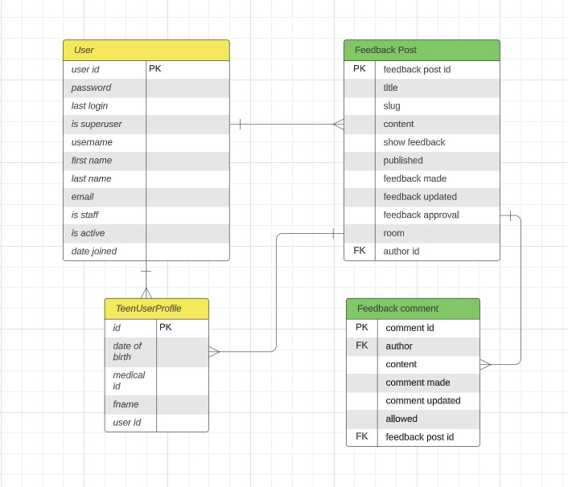

#  AYA Teen Room

## Site Link: <a href="" target="_blank">#</a>

1. [Introduction](#introduction)
2. [User Experience](#user-experience)
3. [Design](#design)
4. [Project Management](#projectd-management)
5. [Features](#features)
6. [Future Features](#future-features)
7. [Testing](#testing)
    1. [Validator Testing](#validator-testing)
    2. [Manual Testing](#manual-testing)
8. [Bugs](#bugs)
    1. [Known Bugs](#known-bugs)
    2. [Solved Bugs](#solved-bugs)
9. [Deployment](#deployment)
    1. [Github](#github)
    2. [Heroku](#heroku)
10. [Credits](#credits)
    1. [Code Used](#code-used)
    2. [Content](#content)
    3. [Technologies Used](#technologies-used)
11. [Acknowledgements](#acknowledgements)

## Site Link: (https://#)

# INTRODUCTION

AYA Teen Room is a website aimed at gathering feedback from AYA Teen Room Users in order to facilitate room owners to improve the rooms according to users needs.

AYA Teen Rooms are rooms based on cancer wards in the 4 main centres that treat cancer for adolescents and young adults (AYAs) in Ireland. The teen rooms are lounge spaces solely for the use of AYAs who are staying in the ward for cancer treatment. These rooms give the AYAs a safe and relaxing space to spend time away from the ward rooms, which are often busy, noisy, and populated with either children or older adults (depending on the ward/hospital).

The philosophy of the AYA treatment team is to always put the users at the centre of every decision made, and making sure the teen rooms are serving the needs of the user by ensuring teen feedback is received, and that the AYAs can see feedback being acted on,  demonstrates this to the AYAs clearly.  This helps to build trust with the treating team, and improves the treatment experience for the AYAs.

# User Experience

## Target Audience

The target audience is AYA patients, who are aged between 13 - 24 years old, who are having cancer treatment at one of the 4 hospitals with an AYA teen room.

## Site Aims

* To provide a way to gather teen room user feedback on the teen rooms
* To allow users to give feedback in a private way
* To allow AYA staff to let users know how their feedback is being implemented

## User Stories

### As a user:

1. As a teen room user I can be a registered site user so that I know only my teen room peers are on the site

2. As a teen room user I can edit my details so that i have control over my username and other details

3. As a teen room user I can change my password so that I know my log in details are secure

4. As a teen room user I can reset my password via email so that it's easy to reset if I forget my password

5. As a teen room user I can receive messages about login status so that i know if I have logged in or out successfully

6. As a teen room user I can easily see if an event has already happened so that I am fully aware of event timetables

7. As a teen room user I can add feedback on the teen room so that the owners know how to improve the room

8. As a teen room user I can post anonymously so that I can be honest with my opinion without worrying people will know who I am

9. As a teen room user I can see when feedback posts were last updated so that I know how recent they are

10. As a teen room user I can see other peoples feedback so that I know what other users think about the room

11. As a teen room user I can amend feedback I have left so that my feedback accurately reflects how I feel

12. As a teen room user I can delete feedback I have given so that I have control over my feedback

13. As a teen room user I can amend a comment i have made so that I can correct any mistakes I have made

14. As a teen room user I can like other users feedback so that I can add weight to their feedback

15. As a teen room user I can indicate if i'm interested in going to an event so that i can be involved in events

24. As a teen room user I can log in to the site with my email address so that I don't have to remember a username

## As the site/room owner:

16. As a room owner I can view medical id of users so that I can engage in safeguarding if there is an issue with a post of concern

17. As a room owner I can see the medical ID of the user posting feedback so that I can perform safeguarding duties if the content is of concern

18. As a site owner I can comment on posted feedback so that I can let users know i have seen their feedback and what actions I am taking to enact it

19. As a site owner I can comment on feedback given so that users can see their feedback is being considered

20. As a site owner I can amend comments i made so that ensure they are accurate

21. As a site owner I can delete comments I have given so that I am only giving comments I wish to

22. As a room owner I can moderate feedback posts so that I can ensure feedback content is appropriate

23. As a Room Owner I can post information about upcoming events so that users are aware of upcoming events

# DESIGN

## Colour scheme

Colour scheme

    

The colour scheme was chosen to complement the images supplied by the AYA team of the rooms, along with the supplied hero image.  A simple colour palatte was selected, to provide a cohesive mature look to the webpage without being boring.

The colours chosen were:
* Barn Red #78000 - used for sub-headings to stand out
* Moonstone #17A2B8 - used for buttons
* Baby Powder #FCF9F3 - used for site background 
* Air Superiority Blue - used for about carosel to draw attention

## Typograhy

The system fonts were utilised in this site, and are efficient and resource friendly as they reduce the resource fetch load.   They give a clean clear and easy to read look to the site.  For Chrome and Android this loads Roboto as the primary font, whereas Segoe UI is loaded for Windows and Windows phones.    

## Imagery

The hero image is of two teens hanging out in a cool looking room.  It's bright and eye-catching, and sums up the point of the site - teens in a room!

## Wireframes

Wireframes for the project are below.  Mobile and desktop wireframes were produced using Balsamiq.  Final product is broadly consistent with the intention and design of the wireframe designs.

 

Home Page Mobile

    

Home Page Desktop

    

Feedback Post Detail Mobile

    

Feedback Post Detail Desktop

    

Feedback List Desktop

    

Sign Up Form Mobile

    

Submit Feedback Mobile

    

---

# Technical Design

## Database schema

Designed at planning stage, the database models were used to guide the development process while building the application.  The initial schema closely reflects the structure of the finished application.

Database schema

    

# Project Management
....

## Agile Methodology

This project was planned and mangaged using an Agile Framework. 

User stories were documented, then placed into a project backlog. Each user story was given a title and a number, and acceptance criteria.  Milestones were created and stories attached to them. Work tracking was done using kanban boards - a separate project board was created for each iteration, and user stories populated to the board from the project backlog.  User stories that ended up as 'won't have' were then returned to the project backlog.  Each board had a to-do, in-progress and done section.

MOSCOW prioritisation was applied to each user story at the outset, and then updated during the project as work progressed. Six prioritisation tasks were used (four for user stories and two for general task tracking):

* Must Have
* Should Have
* Could Have
* Won't Have
* Bug (to track bugs)
* Dev (for development tasks)

Iteration 3 Kanban Board

    

* <a href="https://github.com/users/sarahliz24/projects/6" target="_blank">Project 1 Kanban</a>
* <a href="https://github.com/users/sarahliz24/projects/9" target="_blank">Project 2 Kanban</a>
* <a href="https://github.com/users/sarahliz24/projects/8" target="_blank">Project 3 Kanban</a>
* <a href="https://github.com/sarahliz24/AYA-Teen-Room/issues?q=is%3Aissue+is%3Aclosed" target="_blank">Issues List</a>

# Features

## Nav bar
The nav bar is a fixed nav bar.  It holds a greeting section - this says 'Hi Stranger' if a user is not logged in, and 'Hi Jim' (or relevant username) if the user is logged in - alerting user to log in status at all times.  The nav bar does not change across any page of the site.  It collapses to a hamburger on smaller screens.  Available nav tabs change depending on log in status - if a user is not logged in they only see the home and about tabs, along with a log-in and sign-up button.  A logged in user sees all the site tabs, and a logout button. The active page the user is on is emphasised in bold.

Nav bar large logged in

    

Nav bar large not logged in

    

Nav bar mobile

    

## Home Page

There are three sections to the home page.

Home Page Section 1 - Welcome/Hero

The hero section has simple text introducing the site and it's purpose.  The hero image is bright, eye-catching and engaging, whilst clearly supporting the purpose of the site. A user who is not logged in will see a call to sign up here (not visible for a logged in user).  The format changes to stacked on smaller screens.

Home Page - Hero Desktop

    

Home Page - Hero Mobile

    

Home Page Section 1 - About Carousel

Below the hero section is a blue carousel that catches the eye.  This has three slides, which quickly explain the basics a user needs to know - why we want feedback, why the feedback is private, and what a teen room is.

Home Page - Carousel 1

    

Home Page - Carousel 2

    

Home Page - Carousel 3

    

Home Page Section 1 - Room Featurettes

The last section is a featurette section, with pictures and descriptions of the four teen rooms (and their locations).  

Home Page Room Details

    

## Footer

The footer is consistent with the header in style.  It is a fixed footer, and consistent across every page,. It anchors the page visually, and contains the site author details.

Footer

    

## About Page

The about page is accessible by all users (logged in or not).  It contains a more detailed list of information about AYAs and the teen rooms, contains links to some relevant websites, and contact details for the AYA team.

About 1

    

About 2

    

## Sign Up Page

User can access sign up page from button on hero section or from nav bar button.  Users are reqested for username, email and password on this page. A success message is given if sign up is successful.  Warnings are given if issues with completing form.  Duplicate usernames are not allowed and generate warning text.

Sign up

    

## Sign Up Success

After sign up, user is directed to a info page that explains they need to fill out profile details.  This allows the user to be informed on the reason for collecting the medical ID in this section.

Sign up success

    

## Profile Page

The user then goes to the profile page to complete their user profile.  Help text is present to guide the user, and required fields are starred. User is warned if errors in form.  User gets success message when successfully completed, then redirected to the home page as a logged in user.  The user must enter their medical id - this must be 7 digits or get an erroe message.  helper text is present to prompt user as to where to find their medical id, and how long it is.

Profile Page

    

## Edit Profile

User can access edit profile section from account dropdown on the nav bar. Form is pre-filled with current details.  User sent to home page, with success message, if successful entry.  Warning text if incorrectly filling out fields.

Edit Profile

    

## Change Password

User can access change password section from account dropdown on the nav bar. User sent to home page, with success message, if successful entry.  Warning text if incorrectly filling out fields. Button to return to home page quickly if entered page in error.

Change Password

    

## View Feedback List

Logged in users can view list of feedback given by other users.  This is in order of most recent at top of page. Title and details of user, room it's about, and when posted are displayed.  User can click on title to see full post and other post related options.

Feedback List

    

## View Feedback Detail

Clicking on post title takes user to feedback detail page. Full feedback is shown (if it is longer than the snippet shown on the list page).

Feedback Detail

    

## Submit Feedback

Selecting submit feedback tab takes user to a submission form.  User enters title and feedback content.  If title is same as another title that exists already, user is warned to change it.  User can select room feedback pertains to from dropdown list. On successful submission user is returned to feedback list page with a success message.  If user enters a post title the same as another, it is allowed (as the slug will auto-increment in the backend to compensate).

Submit Feedback

    

## Edit/Delete Feedback

If logged in user is the author of the feedback post, edit and delete buttons are displayed below their own post.  These buttons are not present if the user is not the post author.  

If user selects edit post the post submission form is opened, pre-populated with the post details.  On successful submission a success message is shown, and user taken back to details page.

If user selects delete, they are taken to a warning page.  The colours of these buttons differ from the rest of the site to make them stand out more to the user.  If the user selects 'Oops No!' they are redirected to the feedback list.  If the select delete they are redirected to the feedback list with a successful deletion message displayed.

Feedback Options

    

Edit Feedback Form

    

Delete Feedback

    

## Feedback comments

If a post has no comments there is a message underneath it to say this, and to expect a reply within 24 hours.

If a staff user is logged in they will see a submit-comment form under the post (not visible to standard users). On successful submission user is returned to feedback post with a success message.

No Comments Yet

    

Comment Form

    

Comment Example

    

## Comment Edit/Delete

If a user is staff, and also the comment author, they will see an edit & delete button under the comment.  The process for edit and deleting a comment is the same as that for a feedback post.

Feedback Comment Example

    

Edit Comment

    

Delete Comment

    

## Log out

When a user clicks the log out button they are taken to a log our view, with options to log in or return to home page.

    

## Admin panel

Superuser can access admin panel to disaollow problematic posts, and view medical id within the teen user profile section (in case of safeguarding issues with a post).

Admin Panel

    

Admin Medical ID

    

# Future Features

* Users can "like" posts and comments - User Story 14, 15
* Add pagination to feedback list
* Add sorting and searching to feedback list e.g. filter by room
* Add log in with email function so it's easier to remember (compared to a password) - User Story 24
* Add reset password via email function - User Story 4
* Allow users to add comments to posts - User Story 15, 13

# TESTING

## Validator Testing

The code was regularly tested using the Code Institute PEP Validator substitute
<a href="https://pep8ci.herokuapp.com/" target="_blank">CI Python Linter</a>.  All tests passed with no warnings or errors.

CI Python Linter Results

    

# Manual Testing

## Admin Testing
| Feature | Action | Expected Result | Actual Result | User Story |
|---|---|---|---|---|
| Nav bar | User not logged in | View home & about pages only | ok |  |
| Nav bar | User not logged in | sign up button visible, link active | ok |  |
| Nav bar | User not logged in | Hi Stranger greeting displayed | ok | 5 |
| Nav bar | responsive test | collapses responsively | ok |  |
| Log in | Log in button | takes user to log in form | ok |  |
| Log in | Log in form | sign up button takes user to sign up page | ok |  |
| Log in form | user enters incorrect username or password | user warning | ok |  |
| Log in form | user enters details correctly | user taken to home page, nav bar username greeting displayed | ok | 5 |
| Edit profile form | user enters details incorrectly | user warning | ok |  |
| Edit profile form | user enters details correctly | success message, user returned to home page | ok | 2, 8 |
| Change password form | user enters details incorrectly | user warning | ok |  |
| Change password form | User clicks go back home button | user returned to home page | ok |  |
| Change password form | user enters details correctly | success message, user shown option to log out | ok | 3 |
| Change password form | user can log out or use nav options | logged out or nav options work as user is still logged in | ok |  |
| User sign up | user enters details incorrectly | user warning | ok |  |
| User sign up | user enters details correctly | taken to profile info page | ok |  |
| User sign up | user can choose username of choice | no need to enter real name | ok | 8 |
| User sign up | User enters medical id | if id not 7 digits error message | ok | 16, 17 |
| User sign up | user enters details incorrectly | user warning | ok |  |
| User sign up | user enters details correctly | success message, user returned to home page | ok | 1 |
| User log out | user clicks log out button | taken to log out page, options: log in or go home displayed | ok | 5 |
| User log out | user clicks home button | user returned to home page | ok |  |
| User log out | user clicks log in button | user taken to log in page | ok |  |

## Feedback Posts

| Feature | Action | Expected Result | Actual Result | User Story |
|---|---|---|---|---|
| View feedback list | View feedback link selected | Feedback list displayed | ok |  |
| View feedback list | Look for post details | Username, room & date posted displayed under post title | ok | 9 |
| View feedback list | Look for post details | Truncated content visible | ok |  |
| View feedback list | Click on feedback title | Feedback detail display opens | ok |  |
| View feedback detail | Read feedback | Full feedback content displayed | ok | 6, 10 |
| View comments | Look for comment on feedback | 'Reply from AYA' text present under feedback | ok |  |
| View comments | No comments given yet | 'No replies yet...' text present | ok |  |
| View comments | Comments exist | Comment, with details of commenter & time/date posted displayed | ok | 9, 10 |
| User submit feedback | user clicks feedback submit link | feedback form displays | ok |  |
| User submit feedback | user enters form incorrectly (missing fields) | warning displayed | ok |  |
| User submit feedback | user enters form  with duplicate title | success message, return to feedback list | ok | 7, 23 |
| User submit feedback | user submits feedback | success message, return to feedback list | ok | 7, 23 |
| User Edit Feedback | User did not post the feedback | no edit or delete option available | ok |  |
| User Edit Feedback | User did post the feedback | edit and delete option available | ok |  |
| User Edit Feedback | User clicks edit button | Feedback form displayed with prev. feedback in it | ok |  |
| User Edit Feedback | User submits amended feedback | User returned to feedback list, success message displayed | ok | 11 |
| User Delete Feedback | User clicks delete button | do you want to delete warning displayed w 2 options | ok |  |
| User Delete Feedback | User selected not to delete | user returns to feedback list page | ok |  |
| User Delete Feedback | User selected to delete | user returns to feedback list page, success message displayed | ok | 12 |
| Staff add comment | Staff looks for comment form | comment form is visible under the feedback section | ok |  |
| Staff add comment | user is not staff | no comment form visible | ok |  |
| Staff add comment | staff submits comment | success message, return to feedback list | ok | 18, 19 |
| Staff edit comment | staff looks for edit button | only visible under comment if the staff = the comment author | ok |  |
| Staff edit comment | staff clicks comment edit button | comment form displayed with prev. comment in it | ok |  |
| Staff edit comment | staff submits amended comment | returned to feedback list, success message displayed | ok | 20 |
| Staff delete comment | staff clicks delete button | do you want to delete warning displayed w 2 options | ok |  |
| Staff delete comment | staff selected not to delete | user returns to feedback list page | ok |  |
| Staff delete comment | staff selected to delete | user returns to feedback list page, success message displayed | ok | 21 |

## Misc

| Feature | Action | Expected Result | Actual Result | User Story |
|---|---|---|---|---|
| Nav bar | Active page is obvious to user | Nav tab in bold is congruent with active page | ok |  |
| About page links | user clicks links on bottom of about pager | links open on new page, work correctly | ok |  |
| Admin panel | Super user can disallow posts | disallowed posts are not displayed to users | ok |  |
| User Story | super user can view medical id in Teen User Profile section | super user can view medical id | ok |  |

# BUGS

## Known Bugs
...

 ## Solved Bugs
...

# DEPLOYMENT

This site can be forked using Github as follows (to make a copy in your own repo)

## Github

2. Go to **Fork** button on the right-side ribbon menu (between **Unwatch** and **Star**)
3. Click the button to make a copy automatically into your own respository
4. **Owner** will default to your own github name
5. Add a repository name and an optional  
5. Add a repository name and an optional description 
6. Select **Create Fork** button

This site can be cloned using Github as follows (to make a copy on your own machine):

1. Enter the relevant Github repository
2. Click the green **Code** from the menu (to the left of the green **Gitpod** button)
2. Click the green **Code** button from the menu (to the left of the green **Gitpod** button)
3. Copy the link under https (to copy using HTTPS)
4. Open git bash on your own machine, and select the directory you want to save into
5. Type 'git clone' then copy in your link
The site github link is here: 

## Heroku

### In Github
1. Ensure all input methods have a new line at the end of the text (due to software behaviour of the mock terminal)
2. Create requirements.txt file so Heroku can load required dependancies
    - in workspace terminal, type 'Pip3 freeze > requirements.txt' to automatically update the requirements.txt file
    - push to GitHub

### In Heroku
1. In Heroku dashboard click **Create New App** button
2. Give app a unique name
3. Select region e.g. **Europe**
4. Click **Create App**
5. Go to **Settings** tab
6. Add **Config Vars**:
    1. Click on **Reveal Config Vars** button
    2. Type **CREDS** in the **KEY** field
    3. Copy & paste the contents of the **creds.json** file from github workspace into the **VALUE** field
    4. Click **Add* button
    5. In the next config var row, type **PORT** in the **KEY** field, and add **8000** to the **VALUE** field
7. Add **Buildpacks**:
    1. Click **Add Buildpack** button
    2. Click **Python** in pop-up window and click **Save changes**
    3. Click **Add Buildpack** button again
    4. Click **nodejs** in pop-up window and click **Save changes**
    5. Ensure python buildpack is first in the list (click and drag to re-order if needed)
8. Go to **Deploy** tab
    1. Click on **Github** icon
    2. Click on **Connect to Github** button
    3. In search field, search for repo name and click **Search**
    4. Click **Connect** button
    5. Scroll to bottom of page to select deployment method
        * Click **Deploy Branch** to manually deploy, ensuring desired branch is selected
        * Click **Enable Automatic Deploys** to enable automatic deployment based on every git push (ensuring desired branch is selected)
        6. Click **View** to go to deployed link

# CREDITS

## Code

- Idea for truth value testing to solve 'Solved Bug #5' from <a href="https://flexiple.com/python/check-if-list-is-empty-python/#section2" target="_blank">flexiple</a>

- Working with lists and dictionaries was initally guided by <a href="https://blog.finxter.com/python-list-of-lists/" target="_blank">finxter</a>

- List to dictionary conversions were informed by <a href="https://builtin.com/software-engineering-perspectives/convert-list-to-dictionary-python" target="_blank">builtin</a>

- Code Institute django walk-throughs - set-up and deployment

## Contents
All written content was created by the site author based on professional knowledge.

## Technologies Used

Languages
- <a href="https://www.python.org/" target="_blank">Python</a>

Frameworks
- <a href="https://www.djangoproject.com/" target="_blank">Django</a>Python web framework (backend)
- <a href="https://www.python.org/" target="_blank">Bootstrap 4</a>Front-end web framework

During the creation of this site I used the following technologies:

- <a href="https://github.com/" target="_blank">Git Hub</a> used for online programming, change tracking and storage respository for this project.
- <a href="https://www.heroku.com/" target="_blank">Heroku</a> cloud platform service to deploy, use & manage the application.
- <a href="https://www.elephantsql.com/" target="_blank">Elephant SQL</a> Postgres SQL database service.
- <a href="https://cloudinary.com/" target="_blank">Cloudinary</a>Image and video API platform for image hosting.
-  <a href="https://www.lucidchart.com/pages/templates/login-or-sign-up-page-wireframe">Lucid Charts</a> for database schema creation during devlopment phase.
- <a href="https://tablesgenerator.com/markdown_tables" target="_blank">Tables Generator</a> used to create tables in manual testing section for README.

# Acknowledgements
Thanks to my mentors Spencer Barrilball and Medale Oluwafemi for their advice and support, and my family and colleagues for bearing with me.